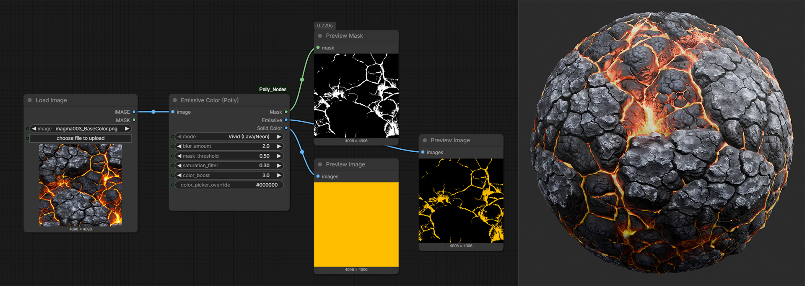

# ComfyUI Polly Nodes

  
   
  <b><i>The Emissive Color node extracting vivid lava highlights while intelligently ignoring white specular reflections.</i></b>

---

A collection of high-quality texture utility nodes for technical artists and environment designers. These nodes focus on precision masking and color extraction for emissive materials like Magma, Lava, Neon, and Cyberpunk lighting.

## 🟢 Emissive Color (Polly)
The flagship node of this pack. Unlike standard brightness-based masking, this node uses **HSV Saturation Logic** to differentiate between "glow" and "glare."

### Key Features
* **Vivid (Lava/Neon) Mode**: Prioritizes highly saturated colors. Perfect for grabbing the "orange" of lava while ignoring the "white" of the light source reflection.
* **Brightest Pixel Mode**: Traditional luminance-based extraction for standard light sources.
* **Saturation Filter**: A precision slider to eliminate grey/white specular highlights from your mask.
* **Color Boost**: Intelligently amplifies the detected color to create punchier emissive maps.
* **Manual Override**: Use a HEX code or the integrated color picker to force a specific emissive hue onto your mask.

## 🛠 Installation

### Method 1: ComfyUI Manager (Recommended)
1. Search for `Polly` in the **Install Custom Nodes** menu.
2. Click Install and restart ComfyUI.

### Method 2: Manual Git Clone
1. Open a terminal in `ComfyUI/custom_nodes/`.
2. Run: `git clone https://github.com/polly-creative/ComfyUI_Polly_Nodes.git`
3. Restart ComfyUI.

## 📋 Parameters
| Parameter | Description |
| :--- | :--- |
| **mode** | Choose between Vivid (Saturation-based) or Brightest (Luminance-based). |
| **blur_amount** | Softens the edges of the generated mask for a natural "glow" falloff. |
| **mask_threshold** | Controls how much of the image is included in the emissive map. |
| **saturation_filter** | Higher values ignore more "white/grey" light, focusing only on pure color. |
| **color_boost** | Multiplier for the intensity of the extracted color. |

## ⚖ License
MIT License - Feel free to use this in any personal or commercial project.

---
*Maintained by Polly Creative. If you find this node helpful, please consider giving the repo a ⭐ on GitHub!*